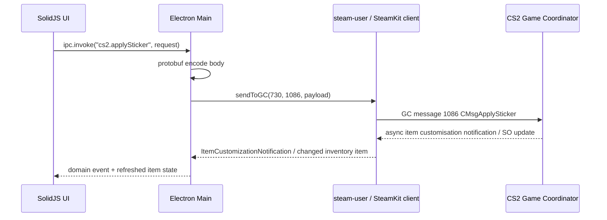

# CS2 protobuf specification and implementation guide for an item-management app

## Executive summary

The practical CS2 item-management “spec” is not a single public Valve document. For transport, authentication, and general inventory concepts, the authoritative sources are Valve’s Steamworks documentation. For the actual Counter-Strike Game Coordinator message schemas used by stickers, storage units, crate operations, inventory ordering, and related item actions, the most useful source is the automatically dumped `csgo/*.proto` set in `SteamTracking/Protobufs`, which explicitly says those protobufs are dumped from Steam/Valve updates using SteamKit’s dumper. SteamKit’s generated code and community libraries such as `node-globaloffensive` and `node-cs2` are the best corroborating sources for message IDs, payload shapes, and observed request/response behaviour. citeturn1search0turn1search2turn1search12turn6search0turn6search2turn6search7turn6search3

For the operations you asked about, the core building blocks are straightforward once separated into “protobuf bodies” versus “raw binary frames”: sticker application uses `CMsgApplySticker` on message ID `1086`; storage-unit operations use `CMsgCasketItem` on `1092`, `1093`, and `1094`; inventory reordering uses `CMsgSetItemPositions` on `1077`; crate opening uses `CMsgOpenCrate` on `2534`; and many newer customisation flows use `CMsgGCItemCustomizationNotification` on `1090`, with enum values such as `RemoveSticker = 1053`, `ExtractSticker = 1054`, `EncapsulateSticker = 1055`, `ApplyPatch = 1090`, `RemovePatch = 1089`, `ApplyKeychain = 1091`, and `RemoveKeychain = 1092`. Trade-ups are a notable exception: the request/response framing observed in community clients is a raw little-endian binary buffer rather than a protobuf message body. citeturn9view0turn10view0turn15view0turn25view0

In Node/Electron, the cleanest implementation is to keep all Steam login, token handling, Game Coordinator transport, and protobuf encode/decode in Electron’s **main** process, then expose a narrow IPC API to a SolidJS renderer. For protobuf tooling, `protobufjs` is the most flexible for runtime schema loading and ad hoc reverse-engineering; `ts-proto` is the best option if you want strongly typed generated TypeScript for a stable, checked-in subset of the CS2 schemas; and `@grpc/proto-loader` is mainly useful if you already need gRPC-style runtime loading, because these CS2 messages are **not** gRPC services. citeturn2search0turn2search1turn2search9turn4search0turn29search0turn29search1

The main implementation risk is not protobuf syntax itself but protocol drift and fragile authentication. Steamworks officially documents session tickets, encrypted app tickets, and secure server-side validation, while community Steam clients such as `steam-user` and `steam-session` handle Steam Guard, refresh tokens, and Steam client logon workflows for the unofficial CM/GC path. Electron security guidance strongly favours context isolation and preload-bridged IPC, and recent 2026 protobuf.js advisories are a further reason to treat all schema inputs as trusted, version-pinned assets rather than loading arbitrary descriptor JSON at runtime. citeturn1search0turn1search1turn1search7turn1search18turn28search0turn28search4turn29search0turn5search0turn5search1

## Where the spec actually lives

The most useful way to think about “the CS2 protobuf spec” is as a stack of sources with different authority levels.

| Priority | Source | What it is best for | Why it matters |
|---|---|---|---|
| Highest for auth and platform rules | Valve Steamworks docs | User auth, ownership checks, session tickets, encrypted app tickets, Steam Inventory Service concepts | These are Valve’s official documents for authentication and inventory-related platform features. They do **not** document CS2 GC item-action protobufs, but they are the source of truth for secure auth patterns. citeturn1search0turn1search1turn1search7turn1search18turn1search20 |
| Highest practical source for CS2 GC schemas | `SteamTracking/Protobufs` | Actual dumped `base_gcmessages.proto`, `econ_gcmessages.proto`, `cstrike15_gcmessages.proto` | The repository states that Steam/Valve protobufs are dumped automatically from updates using SteamKit’s protobuf dumper. This is the closest thing to a living CS2 GC schema set. citeturn6search0turn7search0turn8view0turn8view1turn8view2 |
| Strong corroboration | SteamKit generated GC code | Message IDs, generated message classes, evidence that the dumped protos are consumable by real Steam tooling | SteamKit is the long-running reverse-engineered .NET Steam client stack, and its generated CSGO/CS2 GC code reflects these schemas. citeturn6search2turn6search6turn6search9 |
| Strong behavioural reference | `node-globaloffensive` | Observed flows for craft, casket/storage, connection/GC session lifecycle, inventory convenience mapping | It shows how a mature Node client sends and receives GC messages in practice. citeturn6search7turn12search2turn20search0 |
| Strong behavioural reference for newer CS2 customisation ops | `node-cs2` | Extract/encapsulate sticker, patch/keychain operations, protobuf update workflow | Its release notes and source show how newer CS2 item customisation operations are represented against the current dumped protobufs. citeturn6search3turn12search1turn13search0turn15view0 |
| Broader CS2 change-monitoring source | `GameTracking-CS2` | General CS2 content updates, broader protobuf and asset changes, repo activity | Useful for staying current on CS2 updates even though the item-GC files you need are more directly visible in `SteamTracking/Protobufs`. citeturn6search5turn6search15 |

A practical conclusion follows from that ranking: if you are building a real app today, treat Valve docs as authoritative for **security/authentication**, and treat `SteamTracking/Protobufs` as authoritative for **wire shape**, then validate behaviour against SteamKit and known-working community clients. That gives you the best mix of correctness and survivability when the game updates. citeturn1search0turn6search0turn6search2turn12search2turn13search1

## Relevant message map and reconstructed schema

The item-management surface you asked for is concentrated in `base_gcmessages.proto` and `econ_gcmessages.proto`. The table below maps the most relevant messages and enums.

| Area | GC message ID / enum | Body type | Transport style | Notes |
|---|---|---|---|---|
| Apply sticker | `k_EMsgGCApplySticker = 1086` | `CMsgApplySticker` | Protobuf | Direct sticker application request. citeturn9view0turn10view0 |
| Item customisation notifications | `k_EMsgGCItemCustomizationNotification = 1090` | `CMsgGCItemCustomizationNotification` | Protobuf | Used for many modern operations and async notifications. citeturn10view0turn25view0 |
| Remove sticker | `k_EGCItemCustomizationNotification_RemoveSticker = 1053` | `CMsgGCItemCustomizationNotification` | Protobuf | Present in enum; community pattern strongly suggests `{ item_id, request, extra_data[slot] }`. citeturn10view0turn16view1turn19view0 |
| Extract sticker | `...ExtractSticker = 1054` | `CMsgGCItemCustomizationNotification` | Protobuf | Explicitly used this way in `node-cs2`. citeturn10view0turn16view1 |
| Encapsulate sticker | `...EncapsulateSticker = 1055` | `CMsgGCItemCustomizationNotification` | Protobuf | Explicitly used this way in `node-cs2`. citeturn10view0turn19view1 |
| Add item to storage unit | `k_EMsgGCCasketItemAdd = 1092` | `CMsgCasketItem` | Protobuf | “Casket” is the protocol term for storage unit. citeturn10view0turn15view0 |
| Remove item from storage unit | `k_EMsgGCCasketItemExtract = 1093` | `CMsgCasketItem` | Protobuf | Same body type as add. citeturn10view0turn15view0 |
| Load storage contents | `k_EMsgGCCasketItemLoadContents = 1094` | `CMsgCasketItem` | Protobuf | Community clients send `{ casket_item_id, item_item_id: casket_item_id }`. citeturn10view0turn15view0 |
| Storage notifications | `CasketContents = 1012`, `CasketAdded = 1013`, `CasketRemoved = 1014`, `CasketInvFull = 1015` | `CMsgGCItemCustomizationNotification` | Protobuf | Async GC notifications after storage requests. citeturn10view0turn20search0turn25view0 |
| Trade-up / craft request | `k_EMsgGCCraft = 1002` | none | Raw binary frame | Sent as a ByteBuffer, not a protobuf message. citeturn10view0turn15view0 |
| Trade-up / craft response | `k_EMsgGCCraftResponse = 1003` | none | Raw binary frame | Parsed manually as little-endian fields. citeturn10view0turn25view0 |
| Inventory ordering | `k_EMsgGCSetItemPositions = 1077` | `CMsgSetItemPositions` | Protobuf | Used to reorder inventory slots. citeturn9view0turn10view0 |
| Open crate | `k_EMsgGCOpenCrate = 2534` | `CMsgOpenCrate` | Protobuf | Not one of your required flows, but relevant if you later expand tooling. citeturn9view0turn10view0turn16view4 |
| Shared inventory object | SO type `1` in community code; `CSOEconItem` message | `CSOEconItem` | Protobuf inside SO cache | Main inventory item object sent in `ClientWelcome` cache. citeturn9view0turn25view0turn18view0 |

The most relevant message definitions can be extracted directly from the dumped proto files. The following subset is copied from those dumped schemas, with only unrelated fields omitted for brevity. The final `CraftRequest` and `CraftResponse` are **reconstructed** from community client source because their transport is raw binary rather than a protobuf message. citeturn9view0turn10view0turn15view0turn25view0

```proto
// cs2_item_subset.proto
// Derived from SteamTracking/Protobufs csgo/base_gcmessages.proto and econ_gcmessages.proto
// plus reconstructed raw craft frame definitions from node-cs2 source.

syntax = "proto2";

enum EGCItemMsg {
  k_EMsgGCSetItemPosition = 1001;
  k_EMsgGCCraft = 1002;
  k_EMsgGCCraftResponse = 1003;
  k_EMsgGCUseItemRequest = 1025;
  k_EMsgGCSortItems = 1041;
  k_EMsgGCSetItemPositions = 1077;
  k_EMsgGCApplySticker = 1086;
  k_EMsgGCItemCustomizationNotification = 1090;
  k_EMsgGCCasketItemAdd = 1092;
  k_EMsgGCCasketItemExtract = 1093;
  k_EMsgGCCasketItemLoadContents = 1094;
  k_EMsgGCOpenCrate = 2534;
}

enum EGCItemCustomizationNotification {
  k_EGCItemCustomizationNotification_UnlockCrate = 1007;
  k_EGCItemCustomizationNotification_CasketContents = 1012;
  k_EGCItemCustomizationNotification_CasketAdded = 1013;
  k_EGCItemCustomizationNotification_CasketRemoved = 1014;
  k_EGCItemCustomizationNotification_CasketInvFull = 1015;
  k_EGCItemCustomizationNotification_RemoveSticker = 1053;
  k_EGCItemCustomizationNotification_ExtractSticker = 1054;
  k_EGCItemCustomizationNotification_EncapsulateSticker = 1055;
  k_EGCItemCustomizationNotification_ApplySticker = 1086;
  k_EGCItemCustomizationNotification_RemovePatch = 1089;
  k_EGCItemCustomizationNotification_ApplyPatch = 1090;
  k_EGCItemCustomizationNotification_ApplyKeychain = 1091;
  k_EGCItemCustomizationNotification_RemoveKeychain = 1092;
}

message CMsgApplySticker {
  optional uint64 sticker_item_id = 1;
  optional uint64 item_item_id = 2;
  optional uint32 sticker_slot = 3;
  optional uint32 baseitem_defidx = 4;
  optional float sticker_wear = 5;
  optional float sticker_rotation = 6;
  optional float sticker_scale = 7;
  optional float sticker_offset_x = 8;
  optional float sticker_offset_y = 9;
  optional float sticker_offset_z = 10;
  optional float sticker_wear_target = 11;
}

message CMsgGCItemCustomizationNotification {
  repeated uint64 item_id = 1;
  optional uint32 request = 2;
  repeated uint64 extra_data = 3;
}

message CMsgCasketItem {
  optional uint64 casket_item_id = 1;
  optional uint64 item_item_id = 2;
}

message CMsgOpenCrate {
  optional uint64 tool_item_id = 1;
  optional uint64 subject_item_id = 2;
  optional bool for_rental = 3;
  optional uint32 points_remaining = 4;
  optional uint32 volatile_limit = 5;
}

message CMsgSetItemPositions {
  message ItemPosition {
    optional uint32 legacy_item_id = 1;
    optional uint32 position = 2;
    optional uint64 item_id = 3;
  }
  repeated ItemPosition item_positions = 1;
}

message CSOEconItemAttribute {
  optional uint32 def_index = 1;
  optional uint32 value = 2;
  optional bytes value_bytes = 3;
}

message CSOEconItem {
  optional uint64 id = 1;
  optional uint32 account_id = 2;
  optional uint32 inventory = 3;
  optional uint32 def_index = 4;
  optional uint32 quantity = 5;
  optional uint32 level = 6;
  optional uint32 quality = 7;
  optional uint32 flags = 8 [default = 0];
  optional uint32 origin = 9;
  optional string custom_name = 10;
  optional string custom_desc = 11;
  repeated CSOEconItemAttribute attribute = 12;
  optional CSOEconItem interior_item = 13;
  optional bool in_use = 14 [default = false];
  optional uint32 style = 15 [default = 0];
  optional uint64 original_id = 16 [default = 0];
  optional uint32 rarity = 19;
}

// Reconstructed raw craft frame, not a protobuf message:
struct CraftRequest {
  int16le recipe;
  int16le item_count;
  uint64le item_ids[item_count];
}

struct CraftResponse {
  int16le recipe;
  uint32le reserved_zero;
  uint16le gained_count;
  uint64le gained_item_ids[gained_count];
}
```

For inventory parsing, the raw `CSOEconItem` is only part of the story. Community clients map many item properties from `attribute.value_bytes`, including paint index (`6`), paint seed (`7`), paint wear (`8`), custom name (`111`), sticker-related attributes starting at `113`, casket item count (`270`), and casket linkage via low/high item-ID attributes (`272` and `273`). That mapping is extremely useful if you want your Electron UI to show floats, stickers, and storage-unit contents without reimplementing every attribute lookup from scratch. citeturn18view0turn25view0turn12search2

## TypeScript and Node implementation guidance

The most important implementation detail in JavaScript/TypeScript is that CS2 item IDs are `uint64`, so you must **not** treat them as ordinary JS `number` values. `protobuf.js` requires the `long` module if you need reliable `int64/uint64` support, while `ts-proto` explicitly supports choosing `long`, `string`, or `bigint` representations through `forceLong`. For a new Node/Electron app, `bigint` in the main process or strings across the IPC boundary are the least error-prone choices. citeturn34search7turn34search11turn34search0

### Choosing a protobuf library

| Library | Best fit for this project | Strengths | Caveats |
|---|---|---|---|
| `protobufjs` | Reverse-engineering, dynamic loading of dumped `.proto` files, quick iteration | Loads `.proto` files directly, supports runtime reflection and static code generation, and has matching CLI tools (`pbjs`, `pbts`). citeturn2search0turn2search6turn2search9turn34search11 | If you need `uint64`, you should wire in `long`; also do **not** load untrusted descriptors at runtime. citeturn34search7turn5search0turn5search2 |
| `ts-proto` | Best long-term choice for an app with a checked-in schema subset and strong TS typing | Generates idiomatic TS with `encode`, `decode`, `fromJSON`, and `toJSON`; supports `forceLong=long|string|bigint`. citeturn4search0turn33search2turn34search0 | Requires a codegen step with `protoc`; less convenient if you are constantly swapping raw dumped files during reverse-engineering. citeturn33search2turn32search15 |
| `@grpc/proto-loader` | Only if you already want gRPC-style dynamic loading or shared tooling with `grpc-js` | Purpose-built for loading `.proto` files for gRPC and uses protobuf.js underneath. citeturn2search1turn2search14turn2search20 | CS2 GC messages are not gRPC services, so this adds little value for the GC transport itself. Your actual send path is Steam CM/GC, not `grpc-js`. citeturn2search1turn15view0 |

### Recommended approach

For a CS2 item manager, the most practical split is:

- **Use `protobufjs`** while you are discovering and validating message behaviour.
- **Promote your stable proto subset to `ts-proto`** once the message set settles and you want compile-time safety.
- **Keep `@grpc/proto-loader` out of the critical path** unless your app also talks to real gRPC services. citeturn2search0turn2search1turn4search0

### Building with `protobufjs`

The protobuf.js CLI supports runtime-reflection bundles, static JS generation, and TypeScript declarations. citeturn2search0turn2search6

```bash
npm install protobufjs protobufjs-cli long
```

```bash
# Runtime bundle + d.ts
npx pbjs \
  -t static-module \
  -w commonjs \
  -o src/proto/cs2-proto.js \
  proto/cs2_item_subset.proto

npx pbts \
  -o src/proto/cs2-proto.d.ts \
  src/proto/cs2-proto.js
```

A minimal runtime example for reliable `uint64` handling looks like this. This pattern is appropriate both for real dumped protos and for a narrow local subset file. The `toObject(..., { longs: String })` step is especially useful before sending data across Electron IPC. citeturn34search7turn34search11turn29search1

```ts
import protobuf from "protobufjs";
import Long from "long";

(protobuf.util as any).Long = Long;
protobuf.configure();

export async function loadRoot() {
  return protobuf.load([
    "proto/cs2_item_subset.proto",
  ]);
}

export async function encodeApplySticker() {
  const root = await loadRoot();
  const ApplySticker = root.lookupType("CMsgApplySticker");

  const payload = {
    sticker_item_id: "32188920185",
    item_item_id: "40584216802",
    sticker_slot: 2,
    baseitem_defidx: 0,
    sticker_wear: 0,
    sticker_rotation: 0,
    sticker_scale: 1,
    sticker_offset_x: 0,
    sticker_offset_y: 0,
    sticker_offset_z: 0,
    sticker_wear_target: 0,
  };

  const err = ApplySticker.verify(payload);
  if (err) throw new Error(err);

  const message = ApplySticker.fromObject(payload);
  const bytes = ApplySticker.encode(message).finish();

  const decoded = ApplySticker.toObject(ApplySticker.decode(bytes), {
    longs: String,
    defaults: true,
  });

  return { bytes, decoded };
}
```

### Building with `ts-proto`

`ts-proto`’s README shows the standard `protoc` plugin flow and the generated interface/`encode`/`decode` helper model. For item IDs, `forceLong=bigint` is the cleanest main-process representation; if you prefer simpler IPC serialisation, use `forceLong=string` instead. citeturn33search2turn34search0

```bash
npm install ts-proto protobufjs long
```

```bash
protoc \
  --plugin=./node_modules/.bin/protoc-gen-ts_proto \
  --ts_proto_out=src/gen \
  --ts_proto_opt=forceLong=bigint,esModuleInterop=true \
  --proto_path=proto \
  proto/cs2_item_subset.proto
```

```ts
import { CMsgApplySticker } from "./gen/cs2_item_subset";

const body = CMsgApplySticker.encode({
  stickerItemId: 32188920185n,
  itemItemId: 40584216802n,
  stickerSlot: 2,
  baseitemDefidx: 0,
  stickerWear: 0,
  stickerRotation: 0,
  stickerScale: 1,
  stickerOffsetX: 0,
  stickerOffsetY: 0,
  stickerOffsetZ: 0,
  stickerWearTarget: 0,
}).finish();

const decoded = CMsgApplySticker.decode(body);
console.log(decoded.itemItemId.toString());
```

### Why not use `@grpc/proto-loader` as the main path

`@grpc/proto-loader` exists to load `.proto` files for use with gRPC and is explicitly documented that way. Since your CS2 app is not calling gRPC services, using it as the main schema layer would be a detour: you still need a Steam client transport capable of `sendToGC(appid, emsg, ...)`, and community CS2 clients use exactly that path. citeturn2search1turn2search14turn15view0

If you still want it for introspection consistency in a larger app, a minimal loader configuration is:

```ts
import * as protoLoader from "@grpc/proto-loader";

const defs = protoLoader.loadSync(
  ["proto/cs2_item_subset.proto"],
  {
    keepCase: true,
    longs: String,
    enums: String,
    defaults: true,
    oneofs: true,
  }
);

// Useful for schema loading; not your GC transport.
console.log(Object.keys(defs));
```

## Request and response flows for the operations you care about

The transport model is simple once you stop thinking in REST or gRPC terms. The outer frame is a Steam Game Coordinator message with an app ID (`730`) and an “EMsg” integer. The payload is either a protobuf-encoded body or, for a handful of older messages such as craft/trade-up, a raw binary frame. Community clients call `sendToGC(730, msgType, header, payload)` and then wait for either a direct message response or a shared-object/inventory update. citeturn15view0turn25view0



### Applying a sticker

The direct message for applying a sticker is `k_EMsgGCApplySticker = 1086`, and the body is `CMsgApplySticker`. Newer community clients also observe an `ItemCustomizationNotification` on completion with request type `ApplySticker = 1086`, which you can use as your async acknowledgement before reconciling the item in your local inventory cache. citeturn10view0turn25view0

A sample JSON-shaped payload is:

```json
{
  "sticker_item_id": "32188920185",
  "item_item_id": "40584216802",
  "sticker_slot": 2,
  "baseitem_defidx": 0,
  "sticker_wear": 0,
  "sticker_rotation": 0,
  "sticker_scale": 1,
  "sticker_offset_x": 0,
  "sticker_offset_y": 0,
  "sticker_offset_z": 0,
  "sticker_wear_target": 0
}
```

In TypeScript with `protobufjs`:

```ts
import protobuf from "protobufjs";
import Long from "long";

(protobuf.util as any).Long = Long;
protobuf.configure();

async function buildApplyStickerBody() {
  const root = await protobuf.load(["proto/cs2_item_subset.proto"]);
  const ApplySticker = root.lookupType("CMsgApplySticker");

  const payload = {
    sticker_item_id: "32188920185",
    item_item_id: "40584216802",
    sticker_slot: 2,
    baseitem_defidx: 0,
    sticker_wear: 0,
    sticker_rotation: 0,
    sticker_scale: 1,
    sticker_offset_x: 0,
    sticker_offset_y: 0,
    sticker_offset_z: 0,
    sticker_wear_target: 0,
  };

  const body = ApplySticker.encode(ApplySticker.fromObject(payload)).finish();
  return body;
}

// sendToGC(730, 1086, {}, body)
```

If you encode that exact sample from the dumped field layout, the protobuf body serialises to the following hex, derived from the field numbers in `CMsgApplySticker`: `08f9e2eff47710e28188989701180220002d0000000035000000003d0000803f45000000004d00000000`. That is useful for a regression test, but in production you should generate it rather than hard-coding bytes. citeturn9view0

A practical response flow is:

1. send EMsg `1086` with `CMsgApplySticker`;
2. listen for `ItemCustomizationNotification` of type `1086`;
3. then wait for the corresponding inventory/shared-object change for the item so your renderer refreshes from source-of-truth state rather than assuming success from the outgoing request alone. Community handlers decode `CMsgGCItemCustomizationNotification` and emit only `item_id` plus `request`, so your own main-process domain event should do the same. citeturn10view0turn25view0

### Removing or extracting a sticker

The dumped enum distinguishes **destructive removal** (`RemoveSticker = 1053`) from **extraction** (`ExtractSticker = 1054`) and **encapsulation** (`EncapsulateSticker = 1055`). `node-cs2` explicitly implements extract and encapsulate using `CMsgGCItemCustomizationNotification { item_id, request, extra_data }`, with `extra_data` carrying the slot number for extraction. The same shape is also used there for patch and keychain operations. That makes the following message shape a strong reconstruction for sticker removal as well, even though the community source currently exposes `extractSticker()` rather than `removeSticker()`. citeturn10view0turn16view1turn19view1turn19view0

**Extract sticker** request:

```json
{
  "item_id": ["40584216802"],
  "request": 1054,
  "extra_data": [2]
}
```

**Remove sticker** request, reconstructed by analogy:

```json
{
  "item_id": ["40584216802"],
  "request": 1053,
  "extra_data": [2]
}
```

A minimal TypeScript helper for both:

```ts
type StickerOp = "remove" | "extract";

function buildStickerCustomisation(
  itemId: string,
  slot: number,
  op: StickerOp
) {
  const request =
    op === "remove"
      ? 1053 // RemoveSticker
      : 1054; // ExtractSticker

  return {
    item_id: [itemId],
    request,
    extra_data: [slot],
  };
}
```

The extracted-sticker sample above encodes, from the dumped `CMsgGCItemCustomizationNotification` field numbers, to hex `08e28188989701109e081802`. For a destructive remove, the body is identical except the enum varint changes from `1054` to `1053`. Because there is no public Valve doc for the behavioural contract here, you should treat `RemoveSticker` as a **reconstructed** flow and validate it on a sacrificial test account before you trust it in production. citeturn10view0turn16view1turn19view0

### Performing a trade-up

Trade-ups map to the older “craft” path. Community clients send the request as raw binary: `int16le recipe`, `int16le item_count`, then `item_count` little-endian `uint64` item IDs. The response is also raw binary and is parsed as `int16le recipe`, `uint32le reserved_zero`, `uint16le gained_count`, and then the list of gained item IDs. `node-globaloffensive` further documents commonly used trade-up recipes: `0..4` for normal Consumer→Covert tiers and `10..14` for StatTrak equivalents. citeturn15view0turn25view0turn20search0

A sample request for a normal Consumer→Industrial trade-up with 10 source items is therefore:

```json
{
  "recipe": 0,
  "items": [
    "1001", "1002", "1003", "1004", "1005",
    "1006", "1007", "1008", "1009", "1010"
  ]
}
```

Binary construction in TypeScript:

```ts
function encodeUint64LE(value: bigint): Buffer {
  const out = Buffer.alloc(8);
  out.writeBigUInt64LE(value, 0);
  return out;
}

function buildCraftRequest(recipe: number, itemIds: bigint[]): Buffer {
  const header = Buffer.alloc(4);
  header.writeInt16LE(recipe, 0);
  header.writeInt16LE(itemIds.length, 2);

  return Buffer.concat([
    header,
    ...itemIds.map(encodeUint64LE),
  ]);
}

// sendToGC(730, 1002, null, buildCraftRequest(...))
```

For the sample above, the request begins with `00000a00` — recipe `0`, count `10` — followed by ten `uint64le` item IDs. A minimal example response for one resulting item ID `5001` would serialise as `00000000000001008913000000000000`, which decodes to recipe `0`, reserved `0`, gained count `1`, and gained item ID `5001`. In a real client, you should use the direct `CraftResponse` parse as an acknowledgement and then reconcile against subsequent `itemRemoved`/`itemAcquired` inventory updates exactly as `node-globaloffensive` recommends. citeturn25view0turn20search0

### Moving items into and out of storage units

Storage units are called **caskets** in the protocol and userland libraries. The body is simple:

```json
{
  "casket_item_id": "90000000001",
  "item_item_id": "40584216802"
}
```

The three relevant sends are:

- add item to storage: EMsg `1092`, body `CMsgCasketItem`
- extract item from storage: EMsg `1093`, body `CMsgCasketItem`
- load storage contents: EMsg `1094`, body `CMsgCasketItem`, with community clients sending both IDs as the casket ID for the load request. citeturn10view0turn15view0

TypeScript encode example:

```ts
async function encodeCasketOp(
  root: protobuf.Root,
  casketId: string,
  itemId: string
) {
  const CasketItem = root.lookupType("CMsgCasketItem");

  const payload = {
    casket_item_id: casketId,
    item_item_id: itemId,
  };

  return CasketItem.encode(CasketItem.fromObject(payload)).finish();
}

// Add to storage: sendToGC(730, 1092, {}, body)
// Remove from storage: sendToGC(730, 1093, {}, body)
```

And for loading contents:

```ts
const body = await encodeCasketOp(root, casketId, casketId);
// sendToGC(730, 1094, {}, body)
```

The practical response contract is asynchronous. Community docs state that adding to a storage unit results in an `itemRemoved` for the moved item plus an item-customisation notification of type `CasketAdded`; extracting yields `itemAcquired` plus `CasketRemoved`; loading contents yields `CasketContents` and causes the contained items to appear in the shared inventory cache with a `casket_id` convenience property. That means your app should never update renderer state from the request alone; it should wait for the authoritative post-operation inventory delta. citeturn20search0turn25view0

### Inventory ordering

If you also want inventory slot management, `CMsgSetItemPositions` is the clean protobuf path. A sample body is:

```json
{
  "item_positions": [
    { "item_id": "40584216802", "position": 1 },
    { "item_id": "40584216803", "position": 2 }
  ]
}
```

That maps to EMsg `1077`. The nested `ItemPosition` type supports both legacy `uint32` IDs and modern `uint64 item_id`, so in a new app you should prefer `item_id` and ignore `legacy_item_id` unless you discover an edge case requiring it. citeturn9view0turn10view0turn16view0

## Electron and SolidJS build plan

A good architecture for this project is a strict three-layer desktop app: SolidJS renderer for UI, Electron preload for a narrow typed bridge, and Electron main for Steam login, protobuf encode/decode, GC session management, persistence, and operation orchestration. Electron’s own security guidance recommends context isolation, and its IPC docs recommend channel-based communication between renderer and main. That is exactly the right fit for keeping Steam credentials and tokens out of the renderer. citeturn29search0turn29search1turn29search4

```mermaid
flowchart LR
    UI[SolidJS Renderer] -->|window.cs2.invoke()| Preload[Electron Preload]
    Preload -->|ipcRenderer.invoke| Main[Electron Main]
    Main --> Proto[protobufjs / ts-proto layer]
    Main --> SteamSess[steam-session]
    Main --> SteamUser[steam-user or SteamKit transport]
    SteamUser --> GC[Steam CM / CS2 GC]
    Main --> Cache[(SQLite or local cache)]
    Cache --> Main
    Main -->|push domain events| UI
```

### Recommended project structure

This structure keeps protocol code and UI code cleanly separated:

```text
cs2-item-manager/
  electron.vite.config.ts
  forge.config.ts
  package.json
  proto/
    cs2_item_subset.proto
    dumped/
      base_gcmessages.proto
      econ_gcmessages.proto
      cstrike15_gcmessages.proto
  src/
    main/
      index.ts
      steam/
        session.ts
        gc-client.ts
        operations/
          applySticker.ts
          itemCustomisation.ts
          craft.ts
          storage.ts
          positions.ts
      proto/
        runtime/
          protobuf-root.ts
        generated/
          ...ts-proto output...
      state/
        inventory-store.ts
        operation-queue.ts
      db/
        schema.ts
        items-repository.ts
      ipc/
        channels.ts
        handlers.ts
        contracts.ts
    preload/
      index.ts
      api.ts
    renderer/
      index.tsx
      app.tsx
      router.tsx
      state/
        inventory.ts
        selection.ts
        jobs.ts
      components/
        InventoryGrid.tsx
        ItemDetails.tsx
        StickerEditor.tsx
        TradeUpBuilder.tsx
        StorageUnitPanel.tsx
        ActivityLog.tsx
        ConnectionStatusBadge.tsx
      routes/
        inventory.tsx
        tradeup.tsx
        storage.tsx
        settings.tsx
```

### Build tooling and starter-template options

The most credible starter options today are not equal.

| Option | What you get | Best use here |
|---|---|---|
| Electron Forge + Vite | Forge is the official all-in-one packaging/distribution tool, and its Vite template is the official fast-start path for Vite-based Electron apps. citeturn2search2turn2search8turn30search3turn30search23 | Best default if packaging, installers, and release automation matter most. |
| `electron-vite` + Solid | `electron-vite` advertises out-of-the-box support for TypeScript and multiple front-end frameworks including SolidJS. citeturn2search18turn3search2 | Fastest scaffold if you want the shortest path to Electron+Solid working locally. |
| Solid Vite template + manually integrating Electron/Forge | Solid’s official templates are Vite-based and give you the cleanest Solid setup. citeturn3search3turn3search7 | Good if Solid ergonomics are your first priority, but you still need to add Electron packaging yourself. |
| Community Forge+Solid templates | There are community starters specifically for Solid + Electron Forge. citeturn3search1 | Useful as references, but I would not make them the long-term foundation unless you adopt and maintain the build stack yourself. |

For this app, I would choose **Electron Forge + Vite**, then add Solid manually using the official Solid Vite stack. That gives you a conservative packaging path and an uncontroversial renderer setup. `electron-vite` is the better alternative if you optimise for faster bootstrap over maximal conservatism. citeturn2search8turn2search18turn3search3turn30search3

### IPC pattern

Electron’s IPC model should map to **commands** and **subscriptions**, not generic “send raw protobuf” calls from the renderer. Keep the renderer declarative and the main process imperative. citeturn29search1turn29search4

A good contract is:

```ts
// preload/api.ts
export interface Cs2Api {
  connect(): Promise<void>;
  getInventory(): Promise<InventoryItemDto[]>;
  applySticker(input: ApplyStickerInput): Promise<OperationReceipt>;
  removeSticker(input: RemoveStickerInput): Promise<OperationReceipt>;
  tradeUp(input: TradeUpInput): Promise<OperationReceipt>;
  moveToStorage(input: MoveToStorageInput): Promise<OperationReceipt>;
  moveFromStorage(input: MoveFromStorageInput): Promise<OperationReceipt>;
  loadStorageContents(casketId: string): Promise<InventoryItemDto[]>;
  onInventoryChanged(cb: (ev: InventoryDeltaEvent) => void): Unsubscribe;
  onOperationEvent(cb: (ev: OperationEvent) => void): Unsubscribe;
}
```

The main process should then expose only these operations and keep all protocol choices private. That gives you freedom to swap `protobufjs` for generated `ts-proto` code later without touching the UI.

### State management

Solid’s `createStore` is designed for structured reactive state and is a natural fit for the renderer-side domain cache. For async server/process state, TanStack Query’s official Solid adapter is a good complement because your “server” is effectively the Electron main process accessed over IPC. A clean split is: **local UI state** via `createStore`, **async fetch/mutation state** via Solid Query, and **live pushes** from main via IPC events. citeturn30search0turn30search4turn30search1turn30search13

Suggested renderer state domains:

- `inventoryStore`: current items keyed by item ID
- `selectionStore`: selected items, active filters, current storage unit
- `jobsStore`: pending operations, receipts, failures, retries
- `connectionStore`: Steam login state, GC session state, last inventory sync

### UI components

The renderer should reflect the protocol realities:

- **Inventory grid**: item cards with float, paint, sticker summary, storage badge
- **Item details drawer**: raw proto fields, parsed attributes, action buttons
- **Sticker editor**: slot picker, sticker chooser, wear/rotation/offset controls
- **Trade-up builder**: drag 10 items, validate recipe tier, show predicted output pool
- **Storage unit panel**: contents, free slots, move in/out operations
- **Operation log**: sent message, EMsg, request body preview, ack status, resulting SO delta
- **Connection/health bar**: Steam Guard state, refresh-token age, GC connected/disconnected

Those component choices follow directly from the way community clients surface inventory convenience fields and async item-customisation notifications. citeturn12search2turn20search0turn25view0

### Packaging and testing

Electron Forge is explicitly built for packaging, installers, and publishing. For a Vite-based app, Vitest is a strong unit-test choice because it reuses Vite’s pipeline. For end-to-end desktop testing, Electron’s own docs point to Playwright’s experimental Electron support. citeturn30search3turn30search19turn31search1turn31search4turn31search0

A sensible test matrix is:

- **Unit tests**: proto encode/decode helpers, raw craft-frame parser, inventory attribute mappers
- **Integration tests**: mocked `sendToGC` transport, asserting correct EMsg/body output
- **E2E tests**: Playwright launches the packaged Electron app, drives the UI, and asserts operation events
- **Golden tests**: fixed sample payloads and expected hex/decoded objects, to detect silent schema drift

## Security and authentication notes

Valve’s official guidance for authenticating Steam users revolves around session tickets, the Web API, and encrypted app tickets. The important principle is that secrets and validation logic belong on a secure server: Steamworks explicitly notes that publisher-key auth methods must be called from a secure server and never directly by clients. If your Electron app needs to authenticate the user to **your own backend** in addition to the CS2 GC path, use Valve’s official tickets for that backend boundary rather than inventing your own trust model. citeturn1search0turn1search1turn1search4turn1search7turn1search18

For the Steam client / Game Coordinator connection used by community CS2 tooling, the most practical path is to rely on existing Steam-client libraries. The `steam-user` docs describe refresh-token login, note that modern Steam client logins use refresh tokens, and explain machine-auth tokens for remembered devices when email Steam Guard is in play. The companion `steam-session` library documents the access-token/refresh-token flow after satisfying Steam Guard checks. That makes a strong architectural recommendation: use password entry only to bootstrap a refresh token, then persist the refresh token securely and keep actual Steam credentials out of normal app operation. citeturn28search0turn28search4

Inside Electron, keep **all** Steam login state, tokens, cookies, protobuf roots, and GC sockets in the main process. Electron’s security tutorial recommends context isolation, and its IPC docs describe a preload-bridge pattern that is exactly suited to exposing a narrow safe API to the renderer. The renderer should receive DTOs and operation receipts, not raw tokens and not a direct `ipcRenderer` pass-through. citeturn29search0turn29search1turn29search4

For token storage, the protocol-safe pattern is:

- store the Steam refresh token in the main process only;
- wrap persistence with the OS keychain/credential vault rather than plaintext files;
- rotate and invalidate on Steam auth failures;
- never expose refresh tokens to the renderer;
- never embed any Steamworks publisher API key in the client. citeturn1search7turn1search18turn28search0turn28search4turn29search0

You should also harden your protobuf toolchain. In 2026, protobuf.js received advisories covering arbitrary code execution and related issues when applications load attacker-controlled schemas or JSON descriptors. The practical mitigation for your app is simple: do not accept uploaded `.proto` or protobuf JSON descriptors from users; pin your schema inputs to checked-in files pulled from known repositories; and stay on patched protobuf.js releases if you use it. Applications that only decode messages using trusted application-defined schemas are much less exposed. citeturn5search0turn5search1turn5search2turn5search13turn5search15turn5search16

## Monitoring protobuf changes over time

Because this protocol is reverse-engineered and fast-moving, you should assume schema drift will happen. The strongest monitoring posture combines source watching, descriptor diffs, golden-message tests, and CI alerts. `SteamTracking/Protobufs` is explicitly an automatically tracked dump of Steam/Valve protobuf updates, and `GameTracking-CS2` remains active as a broader CS2 change tracker. Those two repositories are your primary upstream-watch targets. citeturn6search0turn6search5turn6search15

A robust monitoring pipeline looks like this:

1. **Watch upstream repos**: subscribe to releases/commits for `SteamTracking/Protobufs`, `GameTracking-CS2`, and any source library you benchmark against, such as `SteamKit` or `node-cs2`. citeturn6search0turn6search5turn6search2turn13search1  
2. **Regenerate descriptors**: compile your checked-in proto subset into a `FileDescriptorSet` with `protoc --descriptor_set_out`, which is the canonical protobuf-compiler mechanism for serialising schema structure. citeturn32search2turn32search15  
3. **Run semantic break checks**: use `buf breaking` against your previous baseline or against `main`; Buf’s docs explicitly describe it as comparing current protobuf schemas against a past version to detect breaking wire/codegen changes. citeturn32search1turn32search7turn32search21  
4. **Rebuild generated TS**: regenerate `protobufjs` bundles and/or `ts-proto` outputs. citeturn2search6turn33search2  
5. **Run golden tests**: assert that known outgoing payloads still serialise to the expected bytes and that known incoming payloads still decode into the same domain DTOs. These are your early warning for changes that are semantically relevant even if they are technically wire-compatible.  
6. **Fail CI loudly**: open an issue or send a chat alert when either the descriptor diff, codegen diff, or golden tests change.

A minimal descriptor-diff command set is:

```bash
# previous baseline
protoc \
  --proto_path=proto \
  --include_imports \
  --descriptor_set_out=artifacts/baseline.desc \
  proto/cs2_item_subset.proto

# after upstream refresh
protoc \
  --proto_path=proto \
  --include_imports \
  --descriptor_set_out=artifacts/current.desc \
  proto/cs2_item_subset.proto
```

And a Buf-based break check is:

```bash
buf breaking --against '.git#branch=main'
```

A lightweight GitHub Actions workflow could be:

```yaml
name: protobuf-watch

on:
  schedule:
    - cron: "0 3 * * *"
  workflow_dispatch:

jobs:
  verify-protos:
    runs-on: ubuntu-latest
    steps:
      - uses: actions/checkout@v4

      - name: Install protoc
        run: sudo apt-get update && sudo apt-get install -y protobuf-compiler

      - name: Install deps
        run: npm ci

      - name: Refresh upstream dumps
        run: npm run update-protos

      - name: Generate descriptor set
        run: |
          protoc \
            --proto_path=proto \
            --include_imports \
            --descriptor_set_out=artifacts/current.desc \
            proto/cs2_item_subset.proto

      - name: Buf breaking check
        run: npx buf breaking --against '.git#branch=main'

      - name: Regenerate TypeScript
        run: npm run generate-protos

      - name: Run golden protocol tests
        run: npm test -- proto

      - name: Fail on diff
        run: git diff --exit-code
```

The most valuable automated tests are not generic unit tests but **operation-contract tests**. Keep one golden case each for:

- `CMsgApplySticker` encoding
- `CMsgGCItemCustomizationNotification` extract/remove slot encoding
- craft request raw-frame encoding
- craft response raw-frame parsing
- add/remove/load storage-unit bodies
- selected inbound `ItemCustomizationNotification` payloads
- one real `CSOEconItem` decode fixture containing paint, stickers, and casket linkage

Those tests will catch the changes that actually break your app: moved field numbers, signedness changes, long-handling regressions, or transport-style shifts between raw-binary and protobuf bodies. citeturn9view0turn10view0turn15view0turn25view0turn34search0turn34search7