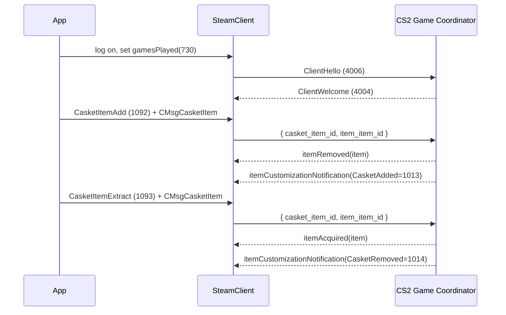
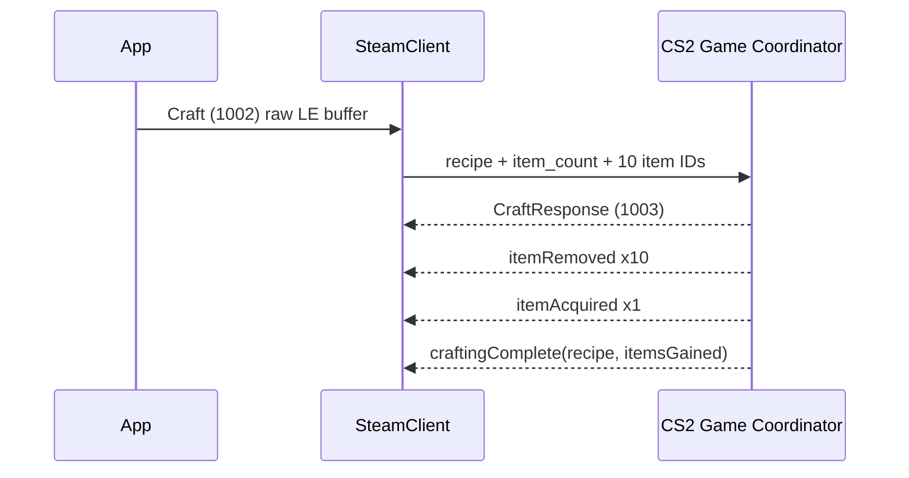
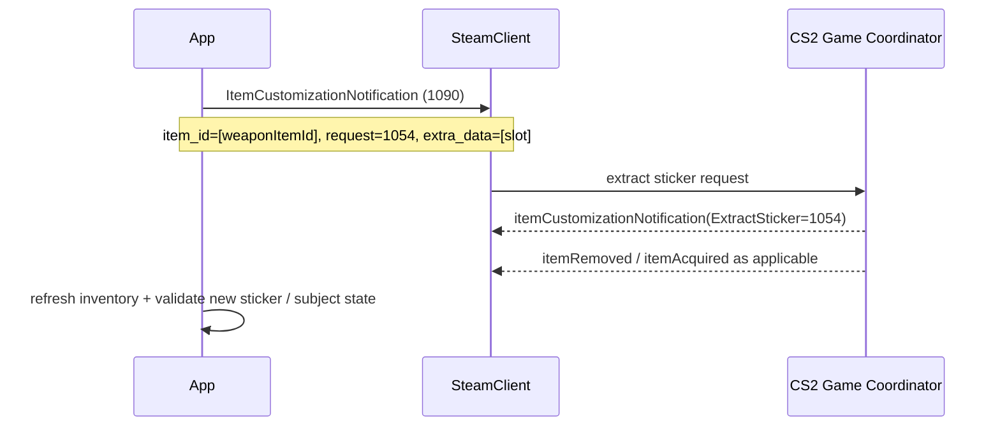

# CS2 item management via protobuf and the Steam Game Coordinator

## Executive summary

A SkinLedger-like application can **read** a great deal of CS2 economy data and can technically **trigger certain inventory mutations**, but not through a clean, public, officially documented CS2 item-management API. The supported, official public surfaces from Valve are things like Steam sign-in, Steamworks authentication, and publisher-scoped Web APIs such as the Steam Inventory Service. Those official APIs are designed for a game publisher managing **its own app’s** inventory, with publisher keys and app permissions, not for a third-party service mutating **Valve’s CS2 inventory** on behalf of end users. In practice, CS2 item-management features such as trade-ups and storage-unit transfers are implemented through the **Steam client protocol plus CS2 Game Coordinator messages**, which are largely undocumented and are maintained in the community via tracked protobuf dumps and reverse-engineered libraries. That is the central architectural fact you need to design around. citeturn25search1turn25search16turn30search0turn13view0turn12search0

The highest-confidence implementation path today is:

1. Use **Steam sign-in / OpenID** for identity in your web app.
2. Use a **user-authorised Steam client session** for actual CS2 inventory mutations.
3. Connect to app **730**, establish a CS2 GC session by launching/playing CS2 and sending **ClientHello (4006)**, then route app-specific GC messages to the CS2 Game Coordinator.
4. Implement mutations using a mixture of:
   - protobuf envelopes such as `CMsgCasketItem` and `CMsgGCItemCustomizationNotification`, and
   - a few non-protobuf binary payloads such as the raw little-endian **Craft (1002)** payload used for trade-ups. citeturn25search10turn25search18turn31view1turn47view0turn47view1turn15view2

Two caveats matter. First, some message names and IDs are public in tracked protobuf dumps, but the **exact payload contract** for operations like **apply sticker** is not fully documented in a stable, official source; that part still requires packet validation against the live client or a current community implementation. Second, Valve’s legal terms are not permissive here: the Steam Subscriber Agreement prohibits unauthorised automation, bots, and tampering with Steam or Content and Services, and limits use to personal, non-commercial use unless expressly allowed. So, although the protocol path exists, this is a **high policy-risk area** for a production commercial product. citeturn21view1turn44view0turn44view2turn44view4

## Where the CS2 protobuf specification actually lives

The most useful public protobuf source is the tracked dump repository maintained from Steam updates. SteamTracking’s protobuf repository states that it automatically tracks Steam and Valve-game protobufs and that the dumps are produced using SteamKit’s protobuf dumper. For CS2 specifically, the practical files you care about are the tracked `csgo/cstrike15_gcmessages.proto` and `csgo/econ_gcmessages.proto`, which remain the relevant GC/economy protobuf definitions for app 730. SteamKit’s generated CS2/CSGO classes mirror those tracked definitions and are an excellent secondary source when you want language bindings or enum values in C#. citeturn30search0turn18search0turn18search2

The key point is that **there is no official Valve page that says “here is the CS2 item protobuf spec”**. What exists publicly is a combination of:

- tracked protobuf dumps,
- generated SteamKit classes,
- battle-tested community libraries such as `node-globaloffensive` and `node-cs2`, and
- packet-capture/NetHook workflows when Valve changes behaviour faster than the ecosystem catches up. SteamKit maintainers explicitly push game-specific GC behaviour out of SteamKit’s core scope, and community guidance commonly points developers to capture and inspect live client traffic for unsupported cases. citeturn30search0turn18search2turn12search0turn1search13turn37search4

For item inspection and item-shape understanding, one of the most useful tracked messages is `CEconItemPreviewDataBlock` from `cstrike15_gcmessages.proto`. It contains the familiar fields your application model already expects for inspected items: `itemid`, `defindex`, `paintindex`, `rarity`, `quality`, `paintwear`, `paintseed`, StatTrak values, custom name, arrays of `stickers`, arrays of `keychains`, `style`, `variations`, and `upgrade_level`. Its nested `Sticker` message includes `slot`, `sticker_id`, `wear`, `scale`, `rotation`, `tint_id`, offsets, `pattern`, `highlight_reel`, and `wrapped_sticker`. Those fields are authoritative in the tracked dump, while the semantic interpretations of some newer fields are still community-maintained. citeturn45view1turn45view2turn45view3turn45view4

For storage units and generic item customisation, the practical protobuf definitions are in `econ_gcmessages.proto`. Two especially important messages are:

```proto
syntax = "proto2";

message CMsgCasketItem {
  optional uint64 casket_item_id = 1;
  optional uint64 item_item_id = 2;
}

message CMsgGCItemCustomizationNotification {
  repeated uint64 item_id = 1;
  optional uint32 request = 2;
  repeated uint64 extra_data = 3;
}
```

These definitions are directly present in the public tracked dumps and in SteamKit’s generated C# output. `CMsgCasketItem` is the wire payload for storage-unit add/extract operations. `CMsgGCItemCustomizationNotification` is a generic envelope used for several modern item customisation workflows, including at least sticker extraction and newer patch/keychain workflows in public community libraries. citeturn18search0turn18search1turn19view0

## Transport, routing, authentication, and what is officially supported

The CS2 item path is **not** a public REST API and **not** a public gRPC service. Operationally, your application talks to the Steam network over the **Steam client protocol**, then routes a payload to the CS2 Game Coordinator for **appid 730**. Community implementations do this with calls equivalent to `sendToGC(730, emsg, header, body)` in Node, or `gameCoordinator.Send(message, APPID)` in SteamKit. Public message-name maps show the important GC routes: `Craft = 1002`, `ApplySticker = 1086`, `ItemCustomizationNotification = 1090`, `CasketItemAdd = 1092`, `CasketItemExtract = 1093`, `CasketItemLoadContents = 1094`, while the base GC session routes include `ClientWelcome = 4004`, `ClientHello = 4006`, and connection-status messages at `4009` and `4010`. citeturn31view1turn47view0turn47view1turn47view2turn47view3turn47view4

A CS2 GC session is established after the account is logged on and marked as playing app 730. The modern Node flow shown by `node-cs2` is:

- log on via `steam-user`,
- set `gamesPlayed([730])`,
- when app 730 is launched, call `helloGC()`,
- send `ClientHello`,
- wait for `connectedToGC`. citeturn13view0turn31view0

The concrete hello payload used in a current community implementation is:

```js
{
  version: 2000244,
  client_session_need: 0,
  client_launcher: 0,
  steam_launcher: 0
}
```

with `GC_HELLO_VERSION = 2000244` and appid `730`. You should treat that hello version as **volatile**, not as a timeless constant. Community issue history shows that GC hello versions have changed in the past and broken older libraries until they were updated. In other words: do not hardcode this once and forget it; source it from a maintained definition or a live-client validation path. citeturn31view0turn33view0turn30search3

For authentication, there are really two separate problems:

| Problem | Recommended path | Notes |
|---|---|---|
| User identity in your website/app | Steam sign-in / OpenID | Valve documents OpenID-based identity linking for web flows. citeturn25search10turn25search18 |
| User-authorised CS2 inventory mutation | Steam client session for that user | Requires a logged-in Steam account and GC session; not achievable through the public Steam Web API alone. citeturn13view0turn25search16 |
| Backend verification of a game client user | Session tickets / Web API auth | Official Steamworks auth covers this, but it is a different problem from mutating CS2 inventory. citeturn25search0turn25search4 |
| Community/web cookies for Steam web surfaces | `webLogOn()` / web session in community libraries | Practical for confirmations and community actions, but distinct from GC mutation paths. Refresh-token and access-token behaviour is evolving. citeturn28search0turn28search1 |

On the “official API” question, the important boundary is this: Valve’s **Steam Inventory Service** (`IInventoryService`) is publisher-only, requires a **publisher Web API key with Economy permissions**, and is explicitly documented as needing a secure server and a publisher key. That makes it suitable for publishers operating their own game’s inventory, but, by inference, not a supported route for a third-party service to mutate Valve’s CS2 economy state. citeturn25search1turn25search16

For implementation technology, the strongest current options are:

- **Node.js**: `steam-user` + `node-cs2` or `node-globaloffensive`, using tracked protobufs. This is the most mature public path for CS2 item features. citeturn13view0turn12search0
- **C#**: `SteamKit2` with the generated CS2 GC classes. This gives you good control over protobuf DTOs and GC routing. citeturn18search2turn37search2
- **Python**: viable if you generate classes from the tracked `.proto` files yourself and implement Steam client/GC transport separately; good for decoding/encoding, less turnkey for the full Steam/GC session stack from the sources reviewed. The protobuf side is straightforward because protobuf itself is language-neutral and supports Python, while the tricky part is Steam transport and GC state. citeturn40search3turn40search4turn41search0

## Key message types, fields, and what they mean in practice

The following table is the most useful “working set” for your app.

| Route / message | ID | Payload type | Purpose | Confidence |
|---|---:|---|---|---|
| `ClientHello` | 4006 | `CMsgClientHello`-style payload | Start CS2 GC session after app 730 is active. citeturn31view0turn47view0 | High |
| `ClientWelcome` | 4004 | GC base response | Confirms the GC is ready to accept app requests. citeturn47view0turn37search2 | High |
| `Craft` | 1002 | **Raw little-endian binary**, not protobuf | Trade-up / crafting request. citeturn15view2turn47view3 | High |
| `CraftResponse` | 1003 | GC response | Completion/ack path for crafting. Public body shape is less commonly surfaced than the higher-level events. citeturn47view3turn11view5 | Medium |
| `ApplySticker` | 1086 | Undocumented in the reviewed public sources | Sticker application route exists; exact payload needs live verification. citeturn20view0turn47view4 | Medium-low |
| `ItemCustomizationNotification` | 1090 | `CMsgGCItemCustomizationNotification` | Generic modern customisation envelope; used publicly for sticker extraction, patches, keychains, and event notifications. citeturn18search0turn15view4turn17view0 | High |
| `CasketItemAdd` | 1092 | `CMsgCasketItem` | Move an item into a storage unit. citeturn15view0turn47view2 | High |
| `CasketItemExtract` | 1093 | `CMsgCasketItem` | Remove an item from a storage unit. citeturn15view1turn47view2 | High |
| `CasketItemLoadContents` | 1094 | no specific payload shown in reviewed sources | Load storage-unit contents into current inventory cache view. citeturn47view2turn11view1 | High |
| `SetItemPositions` | 1077 | payload not reviewed here | Inventory slot/order changes, separate from storage transfers. citeturn47view4 | Medium |

The most important protobuf envelopes are small, which is helpful. `CMsgCasketItem` is simple: `casket_item_id` is the storage-unit item ID, and `item_item_id` is the item being inserted or extracted. `CMsgGCItemCustomizationNotification` is more generic: `item_id` is a repeated list of the item IDs involved, `request` is the operation code, and `extra_data` is a repeated list of operation-specific parameters such as a slot number. That “generic envelope + operation code” design is why the same message can drive sticker extraction, patch operations, keychain operations, and emit customisation events back to the client. citeturn18search0turn19view0turn15view4turn17view0

On the item-shape side, `CEconItemPreviewDataBlock` is excellent for read paths and post-mutation validation. Its field meanings line up with what trading tools already use:

| Field | Meaning |
|---|---|
| `itemid` | The 64-bit CS2 asset/item ID. citeturn45view1turn29view2 |
| `defindex` | Item definition index, identifying the base item type. citeturn45view1turn29view2 |
| `paintindex` | Finish/paint kit index for paintable items. citeturn45view2turn29view2 |
| `paintwear` | Wear value on a 0–1 scale, represented in preview data as an integer field. Community tooling exposes it as a float percentage after decoding. citeturn45view2turn29view4 |
| `paintseed` | Paint seed / pattern seed. citeturn45view2turn29view2 |
| `killeaterscoretype` / `killeatervalue` | StatTrak tracking type and current value. citeturn45view2turn29view2 |
| `stickers[]` | Applied stickers, each with slot, sticker ID, wear, offsets, etc. citeturn45view1turn29view2 |
| `keychains[]` | Keychains with sticker-like placement structure. citeturn45view4turn29view3 |
| `variations[]` | Additional sticker-like variation descriptors for newer cosmetics. citeturn45view4 |
| `style`, `upgrade_level` | Style/upgrade metadata for items that support them. citeturn45view4 |

For storage units specifically, the strongest public indicators are community-decoded inventory attributes. `node-cs2` exposes `DEFINDEX_STORAGE_UNIT = 1201` and reverse-engineered attribute indices including `ATTRIB_CASKET_ITEM_COUNT = 270`, `ATTRIB_CASKET_ID_LOW = 272`, and `ATTRIB_CASKET_ID_HIGH = 273`. The older `node-globaloffensive` documentation surfaces those as decoded app-level fields `casket_contained_item_count` on a storage unit and `casket_id` on items stored inside one. Treat those attribute numbers as reverse-engineered, but they are useful and production-relevant. citeturn33view0turn29view0turn29view1

A practical abridged `.proto` slice for your own generated bindings is:

```proto
syntax = "proto2";

message CMsgCasketItem {
  optional uint64 casket_item_id = 1;
  optional uint64 item_item_id = 2;
}

message CMsgGCItemCustomizationNotification {
  repeated uint64 item_id = 1;
  optional uint32 request = 2;
  repeated uint64 extra_data = 3;
}

message CEconItemPreviewDataBlock {
  message Sticker {
    optional uint32 slot = 1;
    optional uint32 sticker_id = 2;
    optional float wear = 3;
    optional float scale = 4;
    optional float rotation = 5;
    optional uint32 tint_id = 6;
    optional float offset_x = 7;
    optional float offset_y = 8;
    optional float offset_z = 9;
    optional uint32 pattern = 10;
    optional uint32 highlight_reel = 11;
    optional uint32 wrapped_sticker = 12;
  }

  optional uint32 accountid = 1;
  optional uint64 itemid = 2;
  optional uint32 defindex = 3;
  optional uint32 paintindex = 4;
  optional uint32 rarity = 5;
  optional uint32 quality = 6;
  optional uint32 paintwear = 7;
  optional uint32 paintseed = 8;
  optional uint32 killeaterscoretype = 9;
  optional uint32 killeatervalue = 10;
  optional string customname = 11;
  repeated Sticker stickers = 12;
  optional uint32 inventory = 13;
  optional uint32 origin = 14;
  optional uint32 questid = 15;
  optional uint32 dropreason = 16;
  optional uint32 musicindex = 17;
  optional int32 entindex = 18;
  optional uint32 petindex = 19;
  repeated Sticker keychains = 20;
  optional uint32 style = 21;
  repeated Sticker variations = 22;
  optional uint32 upgrade_level = 23;
}
```

This is an **abridged but schema-faithful** subset from the tracked public dumps. citeturn18search0turn45view1turn45view2turn45view4

## Implementation workflows for stickers, trade-ups, and storage units

The best way to design this is to think in terms of a **GC state machine** rather than ordinary HTTP requests. Your backend worker or desktop agent needs to maintain:

- a valid Steam login,
- app-730 “playing” state,
- a live GC session,
- a local inventory cache keyed by item ID, and
- an event stream for `itemAcquired`, `itemRemoved`, `itemCustomizationNotification`, and craft completion. Community libraries expose exactly these event patterns because the mutation acknowledgement often arrives as **state change events**, not just as a neat request/response pair. citeturn12search0turn11view1turn11view5

### Storage transfer workflow

This one is the cleanest and the highest-confidence mutation workflow in the reviewed sources.



The public `node-globaloffensive` documentation states that `addToCasket(casketId, itemId)` emits `itemRemoved` for the moved item and `itemCustomizationNotification` with `CasketAdded`, while `removeFromCasket(casketId, itemId)` emits `itemAcquired` and `itemCustomizationNotification` with `CasketRemoved`. Loading storage contents uses the same inventory-loading mechanism and may cause contained items to appear in your inventory cache with a `casket_id` field, which means your inventory UI must explicitly filter “items in storage” from “items in backpack”. citeturn11view0turn11view1turn29view0turn29view1

Concrete Node-style send path:

```js
// put into storage
user.sendToGC(730, 1092, {}, CMsgCasketItem.encode({
  casket_item_id: "12345678901234567890",
  item_item_id:   "22345678901234567890"
}).finish());

// remove from storage
user.sendToGC(730, 1093, {}, CMsgCasketItem.encode({
  casket_item_id: "12345678901234567890",
  item_item_id:   "22345678901234567890"
}).finish());
```

That message name/ID mapping comes straight from public message maps and community implementations. citeturn15view0turn15view1turn47view2

### Trade-up workflow

Trade-ups are unusual because the request payload is **not protobuf** in the reviewed public implementations. The payload is a little-endian binary buffer:

- `int16 recipe`
- `int16 item_count`
- `uint64 item_ids[item_count]`

Public community documentation also lists the recipe IDs commonly used for standard and StatTrak trade-ups, for example `0` for consumer→industrial, `1` for industrial→mil-spec, through `4`, and `10`–`14` for the StatTrak equivalents. citeturn15view2turn11view5



A representative raw payload builder is:

```text
offset  size  type     meaning
0       2     int16    recipe
2       2     int16    item_count
4       8*n   uint64[] item_ids
```

This very specific layout is directly visible in `node-cs2`’s `craft()` implementation, which writes two 16-bit integers followed by each 64-bit item ID and then sends the buffer as message `Craft`. citeturn15view2turn47view3

### Sticker workflow

This is where you need the most caution.

The public sources reviewed clearly show:

- `ApplySticker = 1086` as an item message ID,
- three sticker-related customisation notification operation codes:
  - `RemoveSticker = 1053`
  - `ExtractSticker = 1054`
  - `EncapsulateSticker = 1055`, and
- a working public implementation for `extractSticker(itemId, stickerSlot)` that sends `ItemCustomizationNotification (1090)` with:
  - `item_id = [itemId]`
  - `request = 1054`
  - `extra_data = [stickerSlot]`. citeturn21view1turn21view2turn21view3turn15view4turn17view0

That yields a high-confidence **extract sticker** flow:



For **remove sticker** and especially **apply sticker**, the public enum/message tables confirm that the operations exist, but the authoritative payload contract was not fully exposed in the sources reviewed. My strongest guidance is:

- treat `RemoveSticker (1053)` as a **separate operation from** `ExtractSticker (1054)`;
- do **not** assume `ApplySticker (1086)` uses the same generic payload shape without validating against the live client or a current working library branch;
- validate final designs with packet capture and replay before shipping. citeturn21view1turn21view2turn21view3turn1search13

A conservative production approach is therefore:

1. ship **read-only sticker state** first;
2. ship **extract sticker** only if you can validate it end to end on sacrificial accounts/items;
3. treat **remove/apply sticker** as feature-flagged, capture-validated operations with rollback plans and inventory reconciliation. citeturn15view4turn24search0turn27search0

## Serialization and deserialization examples in Python and Node.js

The protobuf side is conventional proto2. Google’s protobuf docs remain the reference for proto2 syntax, generated bindings, and wire encoding. The CS2 complication is not protobuf itself; it is the surrounding Steam/GC transport and the fact that some app messages are raw binary rather than protobuf. citeturn41search0turn40search0turn40search3

### Python example

This example assumes you generated Python classes from the tracked `.proto` files with `protoc`.

```python
# pip install protobuf
# protoc --python_out=. econ_gcmessages.proto cstrike15_gcmessages.proto

from econ_gcmessages_pb2 import (
    CMsgCasketItem,
    CMsgGCItemCustomizationNotification,
)
from cstrike15_gcmessages_pb2 import (
    CMsgGCCStrike15_v2_Client2GCEconPreviewDataBlockResponse,
)

def encode_storage_add(casket_id: int, item_id: int) -> bytes:
    msg = CMsgCasketItem(
        casket_item_id=casket_id,
        item_item_id=item_id,
    )
    return msg.SerializeToString()

def encode_extract_sticker(subject_item_id: int, slot: int) -> bytes:
    msg = CMsgGCItemCustomizationNotification(
        item_id=[subject_item_id],
        request=1054,   # ExtractSticker
        extra_data=[slot],
    )
    return msg.SerializeToString()

def decode_preview_response(buf: bytes):
    msg = CMsgGCCStrike15_v2_Client2GCEconPreviewDataBlockResponse()
    msg.ParseFromString(buf)
    item = msg.iteminfo

    return {
        "itemid": str(item.itemid),
        "defindex": item.defindex,
        "paintindex": getattr(item, "paintindex", 0),
        "stickers": [
            {
                "slot": s.slot,
                "sticker_id": s.sticker_id,
                "wear": s.wear if s.HasField("wear") else None,
                "pattern": s.pattern if s.HasField("pattern") else None,
            }
            for s in item.stickers
        ],
    }

def encode_tradeup(recipe: int, item_ids: list[int]) -> bytes:
    # Craft(1002) is NOT protobuf in the reviewed public implementations.
    import struct

    out = bytearray()
    out += struct.pack("<h", recipe)
    out += struct.pack("<h", len(item_ids))
    for item_id in item_ids:
        out += struct.pack("<Q", item_id)
    return bytes(out)
```

The mapping of `CMsgCasketItem`, `CMsgGCItemCustomizationNotification`, and the preview response is grounded in the tracked protobufs, while the craft layout comes from the public `node-cs2` implementation. citeturn18search0turn45view0turn15view2

### Node.js example

This example uses `protobufjs` for encoding and decoding. In a real app you would usually pair this with `steam-user` transport.

```js
// npm i protobufjs
const protobuf = require('protobufjs');

async function loadTypes() {
  const root = await protobuf.load([
    'econ_gcmessages.proto',
    'cstrike15_gcmessages.proto'
  ]);

  return {
    CMsgCasketItem: root.lookupType('CMsgCasketItem'),
    CMsgGCItemCustomizationNotification: root.lookupType('CMsgGCItemCustomizationNotification'),
    PreviewResp: root.lookupType('CMsgGCCStrike15_v2_Client2GCEconPreviewDataBlockResponse')
  };
}

async function encodeStorageAdd(casketId, itemId) {
  const { CMsgCasketItem } = await loadTypes();
  const payload = CMsgCasketItem.create({
    casket_item_id: casketId.toString(),
    item_item_id: itemId.toString()
  });
  return CMsgCasketItem.encode(payload).finish();
}

async function encodeExtractSticker(subjectItemId, slot) {
  const { CMsgGCItemCustomizationNotification } = await loadTypes();
  const payload = CMsgGCItemCustomizationNotification.create({
    item_id: [subjectItemId.toString()],
    request: 1054, // ExtractSticker
    extra_data: [slot]
  });
  return CMsgGCItemCustomizationNotification.encode(payload).finish();
}

function encodeTradeup(recipe, itemIds) {
  const buf = Buffer.alloc(4 + itemIds.length * 8);
  buf.writeInt16LE(recipe, 0);
  buf.writeInt16LE(itemIds.length, 2);

  itemIds.forEach((id, i) => {
    buf.writeBigUInt64LE(BigInt(id), 4 + i * 8);
  });

  return buf;
}
```

When you actually send the data, the routing layer is conceptually:

```js
// storage add
steamUser.sendToGC(730, 1092, {}, storagePayload);

// extract sticker
steamUser.sendToGC(730, 1090, {}, extractPayload);

// trade-up
steamUser.sendToGC(730, 1002, null, craftPayload);
```

Those app IDs and message IDs are directly reflected in public route maps and working libraries. citeturn31view1turn47view1turn47view2turn47view3

### Example decoded item objects

These are **illustrative decoded objects**, suitable for your internal domain model, not claims that every field is always emitted in this exact shape.

```json
{
  "kind": "weapon_skin",
  "itemid": "2480000000000000000",
  "defindex": 7,
  "paintindex": 44,
  "paintwear": 0.0671,
  "paintseed": 321,
  "quality": 3,
  "rarity": 6,
  "stickers": [
    { "slot": 0, "sticker_id": 5001, "wear": 0.00 },
    { "slot": 1, "sticker_id": 5002, "wear": 0.12, "pattern": 3 }
  ]
}
```

```json
{
  "kind": "sticker_item",
  "itemid": "3480000000000000000",
  "defindex": 5001,
  "quality": 4,
  "rarity": 4
}
```

```json
{
  "kind": "container",
  "itemid": "4480000000000000000",
  "defindex": 4001,
  "quality": 4,
  "rarity": 3
}
```

```json
{
  "kind": "storage_unit",
  "itemid": "5480000000000000000",
  "defindex": 1201,
  "casket_contained_item_count": 742
}
```

The storage-unit `defindex` and casket-related fields are grounded in public community constants and decoded inventory docs; the specific sample values above are intentionally illustrative placeholders. citeturn33view0turn29view0

## Error handling, testing strategy, and legal or safety constraints

Your implementation should assume that CS2 mutation calls are **eventually consistent, stateful, and brittle across game updates**. The public libraries surface this reality by wrapping many calls in timeouts, GC-session checks, and event listeners rather than relying on neat synchronous request/response semantics. `node-cs2` uses dedicated timeouts for sticker, crate, casket, profile, and inspection operations, and `node-globaloffensive` documents that successful mutations are typically confirmed through emitted inventory/customisation events. Build your own worker the same way. citeturn14view0turn22view1turn11view0turn11view5

A production-grade error taxonomy should include at least these classes:

| Class | Typical cause | Recommended handling |
|---|---|---|
| No Steam login | Session expired, refresh token invalid | Re-authenticate; rotate refresh token carefully. citeturn28search0turn28search1 |
| No GC session | App 730 not active, hello version stale, GC restarting | Relaunch app state, resend `ClientHello`, exponential backoff. citeturn31view0turn33view0turn30search3 |
| Item ownership mismatch | Item transferred, sold, or in storage | Refresh inventory cache and retry only after reconciliation. citeturn11view1turn29view1 |
| Trade-up invalid | Wrong recipe, wrong tier mix, wrong StatTrak mix, non-tradable or invalid count | Reject client-side before sending craft buffer. citeturn11view5turn15view2 |
| Storage full / inventory full | Storage unit or backpack at limit | Watch for customisation notifications such as `CasketTooFull` / `CasketInvFull`. citeturn17view1turn21view0 |
| Silent GC refusal | Operation not allowed server-side despite valid payload | Treat as non-idempotent failure; refresh state and require operator review. citeturn13view0turn22view1 |

For testing, the public community guidance around Steam automation is blunt and correct: first confirm the operation works in the official Steam/CS2 client on the same account under the same conditions, because many failures are actually account-eligibility or hidden server-side restrictions rather than encoding bugs. Also, when the public schema or route behaviour is incomplete, capture the official client’s live traffic and diff it against your implementation. SteamKit issue discussions and ecosystem practice repeatedly point developers toward that reality for game-specific GC work. citeturn27search0turn37search4turn1search13

My recommended test plan is:

- Use **sacrificial accounts and sacrificial items** only.
- Keep a **shadow inventory cache** and compare it against post-operation item events.
- Record every outbound message by `(appid, emsg, body-bytes-hash)` and every inbound state-change event for replayable debugging.
- Add **schema-diff CI** around SteamTracking/Protobufs so you notice field and enum changes quickly.
- Gate any **destructive** or uncertain operation behind a manual operator approval path and a canary rollout. citeturn30search0turn12search0turn24search0

The legal and safety picture is the hardest constraint. Valve’s Steam Subscriber Agreement explicitly prohibits scripts, bots, macros, and other non-human-controlled automation to interact with Steam Content and Services, prohibits tampering with Steam or Content and Services unless authorised, and limits use to personal, non-commercial use unless expressly permitted. It also restricts reverse engineering and protocol emulation without written consent. That means a commercially operated third-party service automating end-user CS2 item mutations sits in a materially risky policy position even if the protocol work is technically correct. citeturn44view0turn44view2turn44view4

On rate limits specifically, Valve does not publish a neat public GC rate-limit table for these item operations in the sources reviewed. Community projects do warn that spamming certain GC refresh flows can lead to bans or GC penalties. So the safe operational stance is: **low concurrency, per-account work queues, jittered backoff, and user-driven initiation rather than continuous background mutation loops**. citeturn24search6turn44view0

## Open questions and limitations

The biggest unresolved point is **the exact current payload contract for `ApplySticker (1086)` and, to a lesser extent, destructive `RemoveSticker (1053)`**. The public tracked enums confirm the operations exist, and the generic `CMsgGCItemCustomizationNotification` envelope is proven for `ExtractSticker (1054)`, but the reviewed public sources do not provide a single authoritative, current payload example for `ApplySticker` that I would recommend shipping blindly. Treat that part as requiring **live packet validation** before production. citeturn21view1turn21view2turn21view3turn15view4

A second limitation is that some “field meanings” in modern cosmetic structures are still partly inferred by the community, especially newer decorative fields such as `highlight_reel`, `wrapped_sticker`, and `variations`. The tracked protobuf dumps prove the fields exist, but not every semantic nuance is officially documented by Valve. citeturn45view3turn45view2turn45view4

The final practical limitation is operational rather than technical: because current public sources confirm that GC behaviour and hello versions change over time, you should design your app as a **maintained protocol client**, not as a one-off integration. If you are unwilling to continuously track protobuf and behaviour changes, the supported scope should stop at **read-only inventory and inspection features** rather than mutation. citeturn30search0turn33view0turn30search3