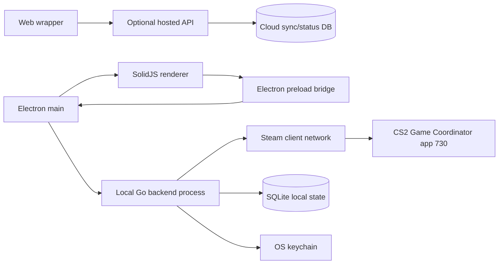

# Electron desktop + web wrapper + Go backend plan

## Executive summary

The recommended product shape is a desktop-first Electron application with a SolidJS renderer, an optional web wrapper for account/status views, and a local Go backend process that owns all Steam client, CS2 Game Coordinator, protobuf, and mutation logic.

This split keeps high-risk protocol work out of the renderer and out of a public web backend. The Electron app provides the user experience, the preload layer exposes a narrow typed API, and the Go service acts as the protocol engine. The web wrapper should be treated as a companion surface, not the authority for CS2 mutations.

The main implementation principle is:

- Electron renderer: UI only.
- Electron main: process lifecycle, local IPC, windowing, auth handoff, packaging.
- Go backend: Steam login/session, app 730 GC connection, protobuf encode/decode, operation queue, inventory cache, mutation safety checks.
- Web wrapper: optional remote dashboard, identity, docs, settings sync, and non-sensitive status.

Because CS2 item mutation relies on undocumented Steam client and CS2 Game Coordinator behaviour, destructive operations should be gated behind live validation on sacrificial accounts and feature flags. Storage-unit operations are the best first mutation target. Sticker application and destructive sticker removal require packet validation before production use.

## Target architecture



The Go backend can run as a bundled sidecar process launched by Electron. Electron should supervise it, restart it on crash, and communicate over a local-only transport such as stdio JSON-RPC, Unix domain socket/named pipe, or localhost with strict origin/token checks.

## Component responsibilities

| Component | Responsibilities | Must not do |
|---|---|---|
| SolidJS renderer | Inventory UI, filters, item details, trade-up builder, storage panel, operation log, user confirmations | Hold Steam tokens, encode raw GC messages, access protobuf schemas directly |
| Electron preload | Typed bridge from renderer to Electron main; subscriptions for operation/inventory events | Expose raw `ipcRenderer`, tokens, sockets, or arbitrary command execution |
| Electron main | App lifecycle, native menus, Go sidecar launch, local RPC bridge, secure token handoff, packaging/update flow | Implement CS2 protocol details in JavaScript unless needed as a temporary mock |
| Go backend | Steam session, Steam Guard flow support, refresh token use, GC hello, protobuf generation/use, item operations, queueing, retries, state reconciliation | Trust renderer input without validation, expose unauthenticated local ports, perform continuous background mutations |
| Web wrapper | Marketing/account shell, remote settings, device pairing, read-only summaries, documentation, support flows | Directly mutate CS2 inventory or store Steam credentials for GC automation |

## Why Go for the backend

Go is a good fit for the protocol engine because it gives you a small, statically typed, easily packaged binary with strong concurrency primitives. The backend needs to maintain long-lived sessions, event streams, operation queues, timeouts, and reconnect logic. That maps well to goroutines, channels, context cancellation, and explicit state machines.

The Go service should use generated protobuf types for the stable schema subset and explicit binary encoders for non-protobuf messages such as trade-up/craft. Avoid ad hoc map-based protobuf construction for core operations once the message set stabilizes.

Recommended Go backend modules:

```text
backend/
  cmd/cs2-backend/
    main.go
  internal/
    app/
      service.go
      config.go
    rpc/
      server.go
      contracts.go
    steam/
      session.go
      guard.go
      gc_client.go
      emsg.go
    proto/
      generated/
      registry.go
    operations/
      storage.go
      tradeup.go
      stickers.go
      positions.go
      queue.go
    inventory/
      cache.go
      decode.go
      attributes.go
    safety/
      validation.go
      approvals.go
      limits.go
    persistence/
      sqlite.go
      migrations/
    keychain/
      store.go
```

## Local RPC contract

The Electron app should talk to Go through domain commands, not raw protobuf calls. This keeps protocol choices private and lets the UI stay stable if the backend switches libraries or adjusts message framing.

Initial command set:

```ts
type BackendApi = {
  health(): Promise<HealthStatus>;
  connectSteam(input: ConnectSteamInput): Promise<ConnectionStatus>;
  submitSteamGuard(input: SteamGuardInput): Promise<ConnectionStatus>;
  disconnectSteam(): Promise<void>;

  getInventory(): Promise<InventorySnapshot>;
  refreshInventory(): Promise<OperationReceipt>;

  loadStorageContents(input: { casketId: string }): Promise<OperationReceipt>;
  moveToStorage(input: { casketId: string; itemId: string }): Promise<OperationReceipt>;
  moveFromStorage(input: { casketId: string; itemId: string }): Promise<OperationReceipt>;

  buildTradeUpPreview(input: TradeUpInput): Promise<TradeUpPreview>;
  executeTradeUp(input: TradeUpInput & ApprovalInput): Promise<OperationReceipt>;

  extractSticker(input: StickerSlotInput & ApprovalInput): Promise<OperationReceipt>;
  removeSticker(input: StickerSlotInput & ApprovalInput): Promise<OperationReceipt>;
  applySticker(input: ApplyStickerInput & ApprovalInput): Promise<OperationReceipt>;

  subscribeEvents(): AsyncIterable<BackendEvent>;
};
```

Every mutation should return an operation receipt immediately, then emit progress events:

```json
{
  "operationId": "op_01J...",
  "type": "storage.moveToStorage",
  "state": "awaiting_gc_confirmation",
  "createdAt": "2026-06-26T01:00:00Z"
}
```

The final success condition should be based on authoritative inventory/shared-object updates, not on successful outbound message encoding.

## Protobuf and protocol plan

Keep checked-in schema inputs under `proto/`:

```text
proto/
  cs2_item_subset.proto
  dumped/
    base_gcmessages.proto
    econ_gcmessages.proto
    cstrike15_gcmessages.proto
```

Generate Go types from the stable subset:

```bash
protoc \
  --go_out=backend/internal/proto/generated \
  --go_opt=paths=source_relative \
  --proto_path=proto \
  proto/cs2_item_subset.proto
```

Use explicit Go encoders for raw binary craft/trade-up messages:

```go
func EncodeCraftRequest(recipe int16, itemIDs []uint64) ([]byte, error) {
    if len(itemIDs) != 10 {
        return nil, fmt.Errorf("trade-up requires exactly 10 items")
    }

    buf := bytes.NewBuffer(make([]byte, 0, 4+len(itemIDs)*8))
    _ = binary.Write(buf, binary.LittleEndian, recipe)
    _ = binary.Write(buf, binary.LittleEndian, int16(len(itemIDs)))

    for _, id := range itemIDs {
        _ = binary.Write(buf, binary.LittleEndian, id)
    }

    return buf.Bytes(), nil
}
```

Use `uint64` internally in Go, but serialize item IDs to the renderer as strings. JavaScript must not receive 64-bit Steam item IDs as numbers.

## Feature phases

### Phase 0: policy and product boundary

Before mutation work, decide the supported product mode:

- read-only inventory/inspection app,
- local personal-use desktop tool,
- commercial third-party mutation product.

The last option carries the highest Steam policy and account-risk burden. The plan should not proceed to public mutation features without explicit legal and product sign-off.

### Phase 1: desktop shell and Go sidecar

Build the Electron app, preload bridge, Go sidecar launch, local RPC, health checks, logging, and update-safe packaging.

Deliverables:

- Electron app starts the Go backend.
- Renderer can call `health()`.
- Backend exposes structured logs and event stream.
- Local transport is authenticated or process-bound.
- Crashes and backend restarts are visible in the UI.

### Phase 2: Steam login and GC connection

Implement Steam login/session handling in Go, including Steam Guard challenge flow, refresh-token persistence through the OS keychain, app 730 playing state, CS2 GC hello, and connection state events.

Deliverables:

- User can connect a Steam account.
- Refresh token is stored outside plaintext app files.
- Renderer sees only connection state, never raw credentials or tokens.
- Backend can reach CS2 GC and maintain reconnect/backoff behaviour.

### Phase 3: inventory read model

Build the inventory cache, protobuf/shared-object decode path, item attribute parsing, and UI views.

Deliverables:

- Inventory snapshot keyed by item ID.
- Paint, wear, stickers, keychains, storage-unit count, and casket linkage where available.
- SQLite-backed local cache.
- Operation log and raw diagnostic view for development builds.

### Phase 4: storage-unit operations

Implement `CMsgCasketItem` operations first because they are the highest-confidence mutation path.

Deliverables:

- Load storage contents.
- Move item into storage.
- Move item out of storage.
- Confirm success from `CasketAdded`, `CasketRemoved`, `CasketContents`, `itemRemoved`, and `itemAcquired` events.
- Reject UI state changes until backend reconciliation confirms the result.

### Phase 5: trade-up workflow

Implement trade-up preview, validation, raw craft-frame encoding, approval UX, and sacrificial-account validation.

Deliverables:

- Client-side validation for count, item ownership, StatTrak compatibility, item tier, and recipe.
- Raw `Craft (1002)` encoder and `CraftResponse (1003)` parser.
- Manual confirmation with a clear irreversible-action receipt.
- Inventory reconciliation after item removal/acquisition events.

### Phase 6: sticker workflows

Start with read-only sticker display and extraction. Treat destructive removal and application as later, gated operations.

Deliverables:

- Read sticker state from inventory/preview data.
- Implement `ExtractSticker (1054)` only after live validation.
- Gate `RemoveSticker (1053)` behind a feature flag and sacrificial-item validation.
- Gate `ApplySticker (1086)` behind packet-capture validation or a current proven implementation.

`ApplySticker` should not be presented as production-ready just because the protobuf message exists. The current plan should require live capture or a current working library branch before enabling it for real items.

### Phase 7: web wrapper

Build the web wrapper only around safe remote functionality.

Appropriate web features:

- account/device overview,
- documentation and onboarding,
- remote settings sync,
- non-sensitive operation history summaries,
- support/export tools,
- read-only inventory summaries if the user explicitly syncs them.

Avoid putting Steam refresh tokens, GC mutation capabilities, or raw item-operation APIs in the hosted web backend. If web-to-desktop control is needed later, use device pairing, explicit local approval, and a narrow command set.

## Safety controls

The backend should enforce safety independent of the renderer:

- per-account operation queue with low concurrency,
- jittered backoff on GC/session failures,
- operation idempotency keys where practical,
- preflight ownership and item-state checks,
- manual approval tokens for destructive operations,
- feature flags for uncertain protocol paths,
- immutable local operation log,
- sacrificial-account mode for validation,
- clear separation between dry-run validation and execution.

Mutation success should require post-operation state reconciliation. A successful `sendToGC` call is not sufficient.

## Testing strategy

Test the Go backend more heavily than the UI because it owns the risky behaviour.

Backend tests:

- protobuf encode/decode golden tests,
- raw craft request/response binary golden tests,
- item ID string/uint64 conversion tests,
- inventory attribute decode fixtures,
- operation queue timeout/retry tests,
- mocked GC event reconciliation tests,
- schema drift tests against checked-in protobufs.

Electron tests:

- preload API shape tests,
- backend process lifecycle tests,
- renderer state update tests from mocked backend events,
- Playwright Electron flows for login, inventory, storage, and confirmation UX.

Manual validation:

- official client can perform the same action first,
- sacrificial account and items only,
- record outbound `(appid, emsg, body hash)` and inbound event sequence,
- compare packet-captured official-client payloads for uncertain operations.

## Packaging and development workflow

Recommended repository layout:

```text
cs2-item-manager/
  apps/
    desktop/
      electron/
      renderer/
      preload/
    web/
      src/
  backend/
    cmd/cs2-backend/
    internal/
  proto/
  packages/
    contracts/
  scripts/
    generate-protos.sh
    build-backend.sh
    dev-desktop.sh
```

Development flow:

1. Run Go backend directly during protocol development.
2. Run Electron with a configurable backend path.
3. Generate shared TypeScript contracts from a schema or keep them in `packages/contracts`.
4. Bundle the Go binary into the Electron app for release.
5. Sign/notarize Electron artifacts as part of packaging.

## Main open risks

| Risk | Impact | Mitigation |
|---|---|---|
| Steam policy/account enforcement | Account restrictions or product shutdown risk | Decide product boundary early; avoid commercial mutation claims without legal review |
| CS2 GC protocol drift | Broken operations after game updates | Schema-watch CI, golden tests, upstream monitoring, feature flags |
| Sticker apply/remove uncertainty | Lost/destructive item state | Packet validation, sacrificial items, gated rollout |
| Local RPC exposure | Local privilege or malicious webpage risk | Process-bound IPC or authenticated local transport, strict CORS/origin checks if localhost is used |
| Token compromise | Steam account compromise | OS keychain, main/backend only, no renderer token access, secure logout/invalidation |
| JavaScript 64-bit precision | Wrong item IDs and irreversible operations | Go `uint64` internally, strings over RPC/UI |

## Recommended first milestone

The first milestone should be a desktop app that can:

1. launch and supervise the Go backend,
2. connect a Steam account with token storage in the OS keychain,
3. establish a CS2 GC session for app 730,
4. read and display inventory,
5. load storage-unit contents,
6. move items into and out of storage units with event-based reconciliation.

Do not include trade-ups, sticker removal, or sticker application in the first milestone. Those should follow only after the operation log, approval UX, sacrificial-account workflow, and protocol validation harness are already working.
